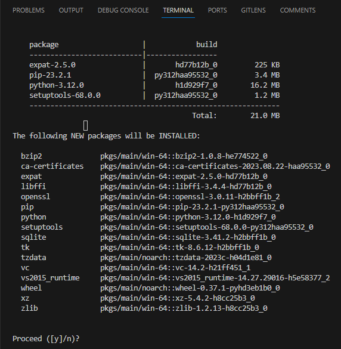

<b>This section is currently work in progress</b>

This is a basic tutorial on how to contribute to the website if you've never used github, git or written any code for a website before.

It is advised to use a context manager and an IDE (integrated development environment) to avoid many problems that arise when setting things up. I would recommend using [Anaconda](https://docs.anaconda.com/free/anaconda/install/index.html){target = "_blank"} which installs the `conda` context manager and Visual Studio Code (VSCode) as the IDE which comes bundled with `conda`. Use the link to install Anaconda, VSCode can be installed once we set up an environment.

### Set up conda environment
Advantage of using conda environments is the ability to have multiple versions of 
python and its packages (it's also easier to remedy mistakes if you break your python).

TO DO: Rewrite this so anaconda prompt is used for installation of venv and vscode.

1. Create a new conda environment
 `conda create -n CAPLEX python`
 This creates a new environment called 'CAPLEX' with the latest version of 
python supported by your conda version. Once python has been configured you will
 be asked whether to proceed so just press enter. Wait for python to download 
and install.

    

2. Activate your new environment
 run `conda activate CAPLEX`
 (base) should change into (CAPLEX) in the terminal.
3. Install mkdocs-material
 This is available either through pip or conda-forge. Whatever you choose to 
use for installation **do not switch between them within one environment**. This 
may cause issues where your packages cannot find each other due to being on 
different channels. So that you may install other packages with pip, this 
tutorial will use
 `pip install mkdocs-material`
 Verify the installation by running `conda list`, you should see an alphabetically 
ordered list of packages including mkdocs-material.

??? note "Connect base conda env to VSCode"

    When using conda make sure to ctrl+shift+P -> Python: Select Interpreter and choose
    whichever environment has the webdev packages installed. Then open a new terminal (1)
    and if successful, it should begin with `(base)` 
    { .annotate }

    1.  On the right side of your terminal window you should see   click on the `+` to open a new terminal.

    .png)

    If you cannot see the terminal at the bottom of your VSCode window, either press `Ctrl+Shift+'` or in the upper left side of VSCode window find Terminal and click New Terminal.

??? question "What if I messed up and this env doesn't work?"

    In this case you can simply delete the environment and remake it. Just don't delete (base) and don't change (base) unless you know what you're doing.
    Firstly deactivate the environment using `conda deactivate` so you're back to (base). Then run `conda remove -n ENV_NAME --all` replace ENV_NAME by CAPLEX or other name you chose.

### Work on a local version of the website

Build a local version of the site so you can see changes take place immediately. Use the `cd` command to guide your terminal into the folder containing the `mkdocs.yml` file. You can see the current path right next to (CAPLEX) in your terminal (1). Once you're done, run `mkdocs serve` which will build a local version of the website. At the bottom on your terminal the final line will contain the address 127.0.0.1:8000. Hold CTRL and click on it to open in your default browser (best to move it to second monitor with VSCode open on your primary monitor).
{ .annotate }

1.  When you write `cd ./` you can press **tab** to scroll through paths found in a particular   folder, saving you typing long folder names.

??? warning "Working on a mac"

    In case you are using mac to contribute, make sure to navigate to the lower right side of your VSCode window and switch `LF` to `CRLF` and make sure to do this on all files you open. 

### Where to find documentation

This website is built using [mkdocs-material](https://squidfunk.github.io/mkdocs-material/){target = "_blank"}. 
Equations are rendered using [MathJax version2.7.7](https://docs.mathjax.org/en/v2.7-latest/){target = "_blank"}. 
Resources for the lexicon are stored in a Google Drive; ask [Ben Dickie](mailto:ben.dickie@manchester.ac.uk) for access.